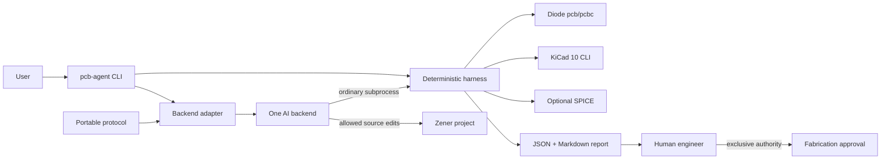
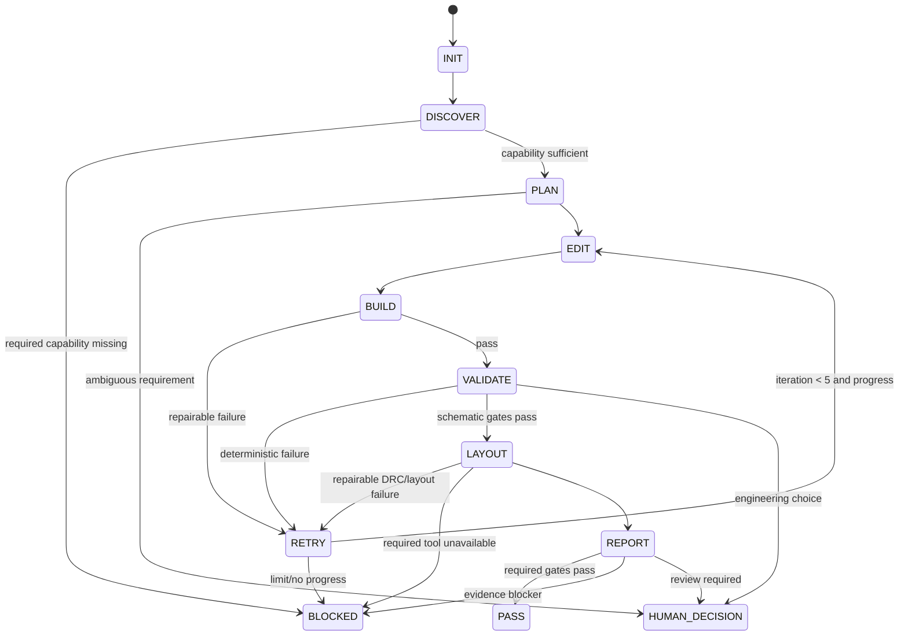

# Blueprint Arsitektur PCB AI Agent Berbasis Diode

Tanggal verifikasi sumber: 2026-08-24. Snapshot source Diode: commit `ee4e7e2b90fbe5f787d165a0780eba42664449ab`; release stabil yang diperiksa: `v0.4.34`. Dokumen ini fase analisis dan desain. Tidak ada instalasi, implementasi final, atau perubahan sistem.

## 1. Executive summary

Rekomendasi utama: arsitektur **harness-centric**. `pcb-agent` menjadi CLI deterministik yang dapat berjalan tanpa AI. Backend AI hanya mengedit file dalam allowlist dan meminta harness memverifikasi hasil. `AGENT_PROTOCOL.md` menjadi instruksi portable; skill hanya panduan workflow.



Keputusan inti:

1. Python standard library untuk core; shell dan PowerShell hanya launcher tipis.
2. `pcb test -f json`, build result, spec, dan expected connectivity menjadi evidence schematic utama.
3. `pcb build --netlist` tidak menjadi public contract karena flag tersembunyi dan stabilitas schema tidak dijamin.
4. Layout sync/check dan KiCad DRC adalah gate terpisah dari schematic correctness.
5. `PASS` otomatis tidak pernah berarti production-ready atau fabrication-approved.

## 2. Verified facts

Status klaim: `VERIFIED`, `LIKELY BUT NOT VERIFIED`, `NOT AVAILABLE`, atau `REQUIRES TEST`.

### Capability matrix

| Capability | Tool | Verified command/API | Input | Output | Machine-readable | Headless | Risiko | Status |
|---|---|---|---|---|---|---|---|---|
| Toolchain selection | `pcb` | `pcb-version`, `pcb +<version>` | Workspace/version selector | Memilih `pcbc` + stdlib | Tidak relevan | Ya | Perubahan patch dalam lane | `VERIFIED` [S1][S2] |
| Compile/build | `pcbc` via `pcb` | `pcb build [PATHS...]` | `.zen`/workspace | Diagnostics/build result | Diagnostics JSON tersedia | Ya; KiCad tidak perlu | Build bukan engineering proof | `VERIFIED` [S3][S4] |
| Dependency hydration | `pcb` | `pcb sync`; `pcb sync --check` | Imports, `pcb.toml` | Manifest/vendor/cache | Exit + diagnostics | Ya | `sync` mutating; vendor content caveat | `VERIFIED` [S5] |
| Zener tests | `pcb` | `pcb test [PATH] -f json` | `TestBench` | Results + summary | JSON dan TAP | Ya | Coverage bergantung test author | `VERIFIED` [S6] |
| Netlist export | `pcb` | `pcb build --netlist` | Zener build | Schematic netlist JSON | Ya | Ya | Flag hidden; schema tidak dijamin stabil | `VERIFIED`, contract `REQUIRES TEST` [S4] |
| Layout generation/update | `pcb` | `pcb layout FILE --no-open -f json` | Zener + layout declaration | `.kicad_pcb` dan metadata | JSON | Ya secara command | Runtime/platform perlu fixture | `VERIFIED` [S3][S7] |
| Layout sync + DRC guard | `pcb` | `pcb layout FILE --check -f json` | Zener + existing board | Semantic sync check + layout path metadata; DRC diagnostics representation belum dikontrakkan | Metadata JSON; diagnostics `REQUIRES TEST` | Ya | Exact diagnostics/schema/version | Command `VERIFIED`; result contract `REQUIRES TEST` [S7] |
| SPICE netlist/simulation | `pcb`, `ngspice` | `pcb simulate`; `--netlist`; `-o` | Simulation + models | `.cir` atau simulator result | SPICE text, bukan JSON | Ya bila deps ada | Model/scenario availability | Command `VERIFIED`; result `REQUIRES TEST` [S8] |
| PCB DRC | KiCad 10 | `kicad-cli pcb drc --format json --exit-code-violations` | `.kicad_pcb` | JSON/report | Ya | CLI dirancang untuk otomasi | JSON schema lintas patch | `VERIFIED` [S9][S10] |
| Schematic ERC | KiCad 10 | `kicad-cli sch erc` | `.kicad_sch` | JSON/report | Ya | Ya | Tidak applicable tanpa schematic | `VERIFIED`, pipeline ini `NOT AVAILABLE` [S11] |
| KiCad schematic output | Diode | Tidak ditemukan | Zener | `.kicad_sch` | Tidak | Tidak relevan | Jangan menganggap helper path sebagai writer | `NOT AVAILABLE` [S7][S12] |

### Platform, format, dan file ownership

| Klaim | Status | Evidence/konsekuensi |
|---|---|---|
| Zener adalah bahasa schematic-as-code berbasis Starlark. | `VERIFIED` | Spesifikasi bahasa [S13]. |
| `pcb` adalah launcher/shim; `pcbc` toolchain/compiler versioned. | `VERIFIED` | README dan source dispatcher [S1][S2]. |
| Linux dan macOS didukung; Windows native eksperimental; WSL2 direkomendasikan untuk Windows. | `VERIFIED` | Quickstart [S3]. |
| Instalasi resmi Unix memakai `install.sh`; Windows memakai `install.ps1`; keduanya dapat memakai `PCB_INSTALL_DIR`. | `VERIFIED` | Quickstart dan installer source [S3][S15]. Blueprint tidak menjalankannya; implementasi bootstrap wajib download-inspect-verify dan meminta consent, bukan pipe-to-shell. |
| KiCad 10.x dibutuhkan untuk layout, tidak untuk build. | `VERIFIED` | Quickstart [S3]. |
| `.zen` memegang intent elektrik. | `VERIFIED` | Build/layout pipeline [S4][S7]. |
| `.kicad_pcb` menyimpan state fisik yang disinkronkan, termasuk placement/routing yang perlu dipertahankan. | `VERIFIED` | Layout update pipeline [S7]. File ini bukan disposable build artifact. |
| Layout sync melakukan semantic comparison, bukan byte comparison. | `VERIFIED` | `check_layout_sync` [S7]. |
| KiCad DRC exit `5` berarti violations bila `--exit-code-violations` digunakan. | `VERIFIED` | Manual/source KiCad [S9][S10]. Harness memetakan ini ke exit domain `1`. |
| Native CLI benar-benar headless pada semua kombinasi OS/build. | `REQUIRES TEST` | Docker resmi mendukung penggunaan CLI; fixture native tetap diperlukan [S14]. |
| Circuitforge, Zenforge, dan Zenpilot PCB tersedia sebagai dependency publik. | `NOT AVAILABLE` | Tidak digunakan. |

### Sumber

- [S1] Diode README dan toolchain: https://github.com/diodeinc/pcb#toolchain-management
- [S2] `pcb` shim dan `pcbc` dispatcher: https://github.com/diodeinc/pcb/blob/main/crates/pcb/src/main.rs dan https://github.com/diodeinc/pcb/blob/main/crates/pcbc/src/main.rs
- [S3] Quickstart: https://docs.pcb.new/pages/quickstart.md
- [S4] Build implementation: https://github.com/diodeinc/pcb/blob/main/crates/pcbc/src/build.rs
- [S5] Packages/sync: https://docs.pcb.new/pages/packages.md
- [S6] Testing: https://docs.pcb.new/pages/testing.md dan https://github.com/diodeinc/pcb/blob/main/crates/pcbc/src/test.rs
- [S7] Layout implementation: https://github.com/diodeinc/pcb/blob/main/crates/pcbc/src/layout.rs dan https://github.com/diodeinc/pcb/blob/main/crates/pcb-layout/src/lib.rs
- [S8] Simulation implementation: https://github.com/diodeinc/pcb/blob/main/crates/pcbc/src/sim.rs
- [S9] KiCad 10 PCB DRC CLI: https://docs.kicad.org/10.0/en/cli/cli.html#pcb_drc
- [S10] KiCad exit codes: https://gitlab.com/kicad/code/kicad/-/blob/10.0/include/cli/exit_codes.h
- [S11] KiCad 10 ERC CLI: https://docs.kicad.org/10.0/en/cli/cli.html#schematic_erc
- [S12] Diode VS Code schematic preview: https://docs.pcb.new/pages/vscode.md
- [S13] Zener specification: https://docs.pcb.new/pages/spec.md
- [S14] KiCad Docker CLI: https://www.kicad.org/download/docker/
- [S15] Installer source pada snapshot: https://github.com/diodeinc/pcb/blob/ee4e7e2b90fbe5f787d165a0780eba42664449ab/install.sh dan https://github.com/diodeinc/pcb/blob/ee4e7e2b90fbe5f787d165a0780eba42664449ab/install.ps1

Referensi `main` di atas menunjukkan lokasi bacaan manusia, bukan evidence immutable. Evidence manifest wajib menyimpan URL yang diselesaikan ke commit `ee4e7e2b90fbe5f787d165a0780eba42664449ab` atau release tag `v0.4.34`, content SHA-256, dan waktu pengambilan. Implementasi roadmap wajib mengganti seluruh URL source penting dengan permalink commit/tag saat architecture contract dibekukan. `pcb_version: "0.4"` adalah author intent; bootstrap menyelesaikannya sekali ke exact toolchain version + artifact hash dalam lock/version manifest untuk setiap run.

## 3. Assumptions and unknowns

| Claim | Status | Treatment |
|---|---|---|
| `pcb test` JSON cukup untuk universal pin-to-net export. | `UNKNOWN` | Gunakan explicit `TestBench`; lakukan spike hierarchy/pin mapping. |
| Hidden netlist JSON stabil antar-Diode patch. | `UNKNOWN` | Versioned experimental adapter; bukan gate MVP. |
| `pcb layout --check` JSON schema stabil. | `UNKNOWN` | Simpan raw evidence; parser dipin ke tool version. |
| Layout sync idempotent untuk seluruh board nyata. | `REQUIRES TEST` | Two-run semantic diff fixture. |
| Semua MPN/package/rating dapat diverifikasi otomatis. | `UNKNOWN` | Missing authoritative evidence menjadi `BLOCKED` atau `HUMAN_REVIEW`. |
| SPICE model tersedia untuk komponen target. | `UNKNOWN` | Optional check `SKIPPED`; required check `BLOCKED`. |
| Backend AI punya structured output stabil. | `REQUIRES TEST` | Probe installed `--help`; correctness tetap dari harness. |

## 4. Recommended architecture

Tiga lapisan tetap terpisah:

| Lapisan | Responsibility | Boundary |
|---|---|---|
| Deterministic harness | Doctor, safe subprocess, build/test/sync/layout/DRC, spec/connectivity rules, aggregation, reports, stable exit codes | Dapat dipakai tanpa AI; seluruh gate kritis berada di sini |
| Portable agent protocol | Allowed/denied files, command wajib, lima iterasi, stop/escalation, immutable acceptance, report contract | Teks normatif vendor-netral; tidak menjalankan validator |
| AI adapters + skill | Detect/version/prepare/execute/terminate backend; workflow/domain guidance | AI bukan source of truth; skill tidak menyimpan validation logic kritis |

Teknologi harness:

| Opsi | Cross-platform | Subprocess/JSON | Footprint | Distribution | Maintenance | Putusan |
|---|---|---|---|---|---|---|
| Bash | Lemah di Windows | Quoting rawan | Rendah | Unix mudah | Shell divergence | Tolak untuk core |
| Python | Baik | Stdlib kuat | Runtime Python | Package/zipapp nanti | Rendah-menengah | **Utama** |
| Rust | Sangat baik | Kuat | Binary tunggal | Sangat baik | Build/complexity lebih besar | Alternatif |
| Node.js | Baik | Kuat | npm/runtime lebih besar | Baik | Supply-chain lebih luas | Tidak dipilih |
| Hybrid besar | Variabel | Baik | Tinggi | Kompleks | Semantics ganda | Tolak |

Python stdlib menyediakan `argparse`, `subprocess`, `json`, `pathlib`, `hashlib`, `tomllib`, logging, timeout, dan atomic file operations. JSON/TOML menjadi canonical MVP agar parser YAML baru tidak diperlukan. YAML dapat ditambahkan sebagai authoring format setelah kebutuhan nyata.

## 5. Alternative architectures

| Kriteria | A: Skill-centric | B: Harness-centric | C: Local service |
|---|---|---|---|
| Portability | Rendah | Tinggi | Tinggi |
| Security boundary | Lemah | Kuat | Kuat tetapi surface besar |
| Complexity | Rendah awal | Sedang | Tinggi |
| Testability/reproducibility | Rendah | Tinggi | Tinggi |
| Offline | Backend-dependent | Baik | Baik |
| Multi-user | Buruk | Lokal | Baik |
| CI/debugging | Prompt-rapuh | Command/evidence jelas | Perlu service tracing |
| Maintenance | Logic terduplikasi | Satu core | Auth/queue/DB/lifecycle |

Pilih B. C baru layak saat antrean multi-user, centralized policy, atau remote isolated workers menjadi kebutuhan nyata. A ditolak karena validator dalam prompt sulit diuji dan mudah dimanipulasi.

## 6. Component responsibility matrix

| Aktor | Creates | Validates | Approves | May modify | Must not modify |
|---|---|---|---|---|---|
| User | Task dan requirement | Intent/scope | Scope dan keputusan produk | Spec sebelum run dikunci | Raw evidence |
| AI CLI | Draft/perbaikan Zener, inference | Tidak menentukan final PASS | Tidak ada | Allowlist source | Acceptance, policies, validators, evidence |
| Agent skill | Workflow guidance | Tidak ada critical gate | Tidak ada | Tidak menulis mandiri | Report/evidence truth |
| PCB harness | Reports/manifests | Policy, spec, connectivity, aggregation | Tidak ada | Reports/generated paths | Requirements/source intent |
| Diode compiler | Build/test/layout artifacts | Syntax, modules, board/test semantics | Tidak ada | Output miliknya | Spec/acceptance |
| KiCad | DRC artifacts | PCB design rules | Tidak ada | DRC output | Zener/spec |
| SPICE | Simulation artifacts | Configured numerical scenario | Tidak ada | Simulation output | Acceptance |
| Datasheet | Authoritative external evidence | Pin/package/rating basis | Tidak ada | N/A | Tidak diperlakukan sebagai agent instruction |
| Human engineer | Review record | Datasheet, SI, thermal, mechanical, DFM | Fabrication | Human approval fields | Raw tool evidence |

Jawaban eksplisit: AI atau manusia membuat Zener; harness menentukan compile berhasil dari Diode; harness memeriksa konektivitas dari deterministic tests/evidence; AI dapat membantu ekstraksi datasheet tetapi engineer mengesahkan; harness menentukan gate layout dari sync + DRC; hanya manusia menyetujui fabrikasi. AI tidak boleh memberi waiver, mengubah acceptance, menyetujui compliance, atau menyatakan fabrication-ready.

## 7. Repository structure

```text
pcb-ai-agent/
├── pyproject.toml
├── pcb-agent
├── AGENT_PROTOCOL.md
├── AGENTS.md
├── CLAUDE.md
├── GEMINI.md
├── config/{agents.toml,policies.toml}
├── src/pcb_agent/
│   ├── {cli,process,policy,report,state,diode,kicad,spice}.py
│   └── backends/{base,codex,claude,gemini,aider,custom}.py
├── schemas/{specification,connectivity,verification-report}.schema.json
├── fixtures/
├── tests/
├── projects/<board>/
│   ├── SPEC.json
│   ├── ACCEPTANCE.json
│   ├── expected-connectivity.json
│   ├── src/
│   └── layout/
├── reports/
└── skill/diode-pcb-agent/
    ├── SKILL.md
    ├── agents/openai.yaml
    ├── scripts/inspect-verification-report.py
    ├── references/{zener-workflow,schematic-review,layout-review,failure-classification}.md
    └── assets/project-template/
```

| Class | Location/rule |
|---|---|
| Harness/reusable | `src/pcb_agent`, schemas, policies, adapters |
| Board-specific | Spec, acceptance, expected connectivity, Zener, maintained `.kicad_pcb` |
| Generated | Logs, raw DRC/test output, reports, temporary build artifacts |
| `.gitignore` | Caches, temp, backend sessions, credentials, per-run logs; jangan abaikan maintained `.kicad_pcb` |
| No duplication | Command/status/schema rules hanya di harness/protocol; backend docs hanya shim |
| Skill location | Satu repo untuk MVP dan version alignment; publish terpisah kemudian melalui contract version |

`AGENTS.md`, `CLAUDE.md`, dan `GEMINI.md` hanya menunjuk `AGENT_PROTOCOL.md`. Skill tidak membutuhkan README, installation guide, quick reference, atau changelog terpisah.

## 8. Command contract

Global: subprocess selalu argument array dan `shell=False`; JSON tunggal ke stdout dengan `--format json`; diagnostics manusia ke stderr; path harus canonical dan tetap dalam workspace; report ditulis atomically.

| Exit | Domain meaning |
|---:|---|
| 0 | Semua required checks selesai dan PASS |
| 1 | Validation failure |
| 2 | Dependency/environment blocker |
| 3 | Invalid specification/configuration/input |
| 4 | AI backend crash/timeout/contract failure |
| 5 | Human decision required |

Lima kode cukup. Detail tetap di JSON. Exit tool eksternal dinormalisasi, bukan diteruskan mentah.

| Command | Purpose/input | Machine + human output | Side effect/idempotency | Prerequisite | Exit/failure/security |
|---|---|---|---|---|---|
| `bootstrap` | Prepare local toolchain policy and automated fixtures | JSON manifest + setup summary | With consent, local cache/project files; repeatable | Supported platform + pinned metadata | `0/2/3`; no `sudo`; inspect/hash installer; no pipe-to-shell |
| `doctor` | Detect paths, versions, capabilities | JSON capabilities + readable table | None; idempotent | None | `0`, or `2` when required dependency missing; reject untrusted executable path |
| `init <project>` | Create board contract/template | JSON created paths + summary | Creates new directory; idempotent only if exact empty template | Valid workspace/name | `0/3`; reject non-empty target, traversal, symlink, overwrite |
| `build [project]` | Run Diode compiler | Raw logs/check JSON + concise diagnostics | Reports/cache only; source-idempotent | Valid spec + trusted Diode | `0/1/2/3`; compiler fail `1`, tool blocker `2` |
| `check schematic` | Run immutable/generated Diode TestBench | Raw test JSON + findings | Reports only; idempotent | Build + locked test definitions | `0/1/2/3`; malformed tool output is compatibility blocker `2` |
| `check spec` | Validate schema and deterministic requirements | Requirement JSON + table | Reports only; idempotent | Valid contract | `0/1/3`; mismatch `1`, malformed spec `3` |
| `check connectivity` | Compare expected topology | Pin/net diff JSON + table | Reports only; idempotent | Stable locked test evidence | `0/1/2/3`; unavailable mapping `2`, mismatch `1` |
| `layout` | Generate/update/check maintained board | Raw layout metadata + summary | May mutate `.kicad_pcb`; semantic idempotency required | Build pass + backup manifest | `0/1/2/3`; atomic publish, root containment, pre/post diff |
| `drc` | Run KiCad 10 read-only DRC | Raw/normalized JSON + violation table | Reports only; idempotent | Trusted KiCad + board | `0/1/2/3`; KiCad `5` maps `1`; other exits classified |
| `verify` | Orchestrate active profile gates | Canonical JSON + Markdown | Reports only except explicit layout phase; repeatable | Valid project/profile | `0/1/2/3/5`; precedence below |
| `run --backend` | Start one bounded AI backend | Iteration/report JSON + human summary | Allowed source edits + reports; not generally idempotent | Known backend capability + clean session lock | `0-5`; nested run rejected; timeout/cost/file/network limits |
| `report` | Render existing evidence | JSON and Markdown | Reports only; idempotent | Complete evidence manifest | `0/2/3`; missing/corrupt evidence never PASS |
| `clean --dry-run` | List removable artifacts | JSON manifest + readable list | None; idempotent | Workspace manifest | `0/3`; no deletion, traversal, symlink follow, or generic recursion |

`pcb build --netlist` hanya capability eksperimental internal setelah version probe. Jangan ekspos sebagai stable public command.

Grammar lengkap: `pcb-agent run --backend <codex|claude|gemini|aider|custom> [--project <workspace-relative-project>] "<task>"`. Task diteruskan sebagai satu argument/stdin/file, tidak pernah digabung ke shell string. Setiap command menerima project path workspace-relative atau current project yang tervalidasi; tabel di atas bersifat normatif untuk purpose, input, machine/human output, side effect, idempotency, prerequisites, exits/failures, dan security. Detail schema per command dibekukan pada Milestone A sebelum coding.

## 9. Data contract

Official check status: `PASS | FAIL | BLOCKED | SKIPPED | HUMAN_REVIEW`. `WARNING` adalah severity (`error | warning | info`), bukan status.

```json
{
  "schema_version": "1",
  "project": {"name": "sensor-board", "pcb_version": "0.4", "layers": 4},
  "requirements": [{
    "id": "REQ-001",
    "type": "decoupling",
    "subject": "U1",
    "constraints": {"minimum_count": 1, "value": "100nF"},
    "severity": "error",
    "evidence_required": ["connectivity", "human_layout_review"]
  }],
  "fabrication": {"automatic_approval": false, "human_approval_required": true}
}
```

```json
{
  "schema_version": "1",
  "components": {
    "U1": {"kind": "sensor", "mpn": "EXPECTED_MPN", "package": "EXPECTED_PACKAGE"},
    "R1": {"kind": "resistor", "value": "4.7kohm"}
  },
  "nets": {
    "I2C_SDA": {
      "members": ["U1.SDA", "R1.P1"],
      "required_pullup": {"component": "R1", "rail": "3V3"}
    }
  },
  "rules": {"forbid_unlisted_members": false, "required_power_nets": ["3V3", "GND"]}
}
```

```json
{
  "schema_version": "1",
  "run_id": "immutable-run-id",
  "status": "FAIL",
  "production_ready": false,
  "fabrication_approved": false,
  "project": "sensor-board",
  "source_commit": "git-sha-or-null",
  "specification_hash": "sha256:...",
  "acceptance_hash": "sha256:...",
  "versions": {"pcb": "...", "pcbc": "...", "kicad": "10.x"},
  "checks": [{
    "id": "CONNECTIVITY",
    "status": "FAIL",
    "severity": "error",
    "provenance": "harness",
    "message": "U1.SDA tidak cocok dengan I2C_SDA",
    "evidence": {"artifact": "reports/raw/pcb-test.json", "sha256": "..."}
  }],
  "human_review": {"required": true, "approved": false, "approver": null}
}
```

Provenance: `tool` = raw deterministic fact; `harness` = deterministic derivation; `ai_inference` = non-gating analysis; `unverified_claim` = no adequate evidence; `human_approval` = identified, timestamped, scoped decision.

Aggregation memakai precedence total: invalid contract/config menghasilkan run status `BLOCKED`, reason `INVALID_CONFIG`, exit `3`; backend crash/timeout/no-progress/iteration-limit menghasilkan `BLOCKED`, reason spesifik, exit `4`; required dependency/evidence blocker menghasilkan `BLOCKED`, exit `2`; required validation failure menghasilkan `FAIL`, exit `1`; unresolved required human gate menghasilkan `HUMAN_REVIEW`, exit `5`; selain itu run `PASS`, exit `0`. Check status selalu faktual. Optional check yang tidak dipilih sejak awal adalah `SKIPPED`; optional check yang dijalankan tetap menyimpan `FAIL`/`BLOCKED`, tetapi tidak mengubah overall run kecuali policy menyatakan promotion rule sebelum run. Warning severity tidak mengubah status kecuali policy juga mempromosikannya sebelum run. Verification `PASS` tetap menyimpan `production_ready: false`.

## 10. Autonomy state machine



```python
def run_agent(task, backend, workspace):
    session = None
    snapshot = None
    lock = None
    try:
        reject_if_nested_agent()
        lock = acquire_owned_session_lock()
        set_child_env("PCB_AGENT_ACTIVE", lock.run_id)
        policy = load_locked_policy(workspace)
        locked_hashes = hash_locked_files(policy)  # includes generated TestBench
        capabilities = doctor()
        if capabilities.missing_required:
            return report("BLOCKED", reason="DEPENDENCY", exit_code=2)
        previous_fingerprint = None
        session = backend.start(task, workspace, timeout=policy.timeout)
        for iteration in range(1, 6):
            snapshot = create_recovery_snapshot()
            backend.execute_bounded_step(session)
            diff = inspect_diff()
            enforce_workspace_allowlist_and_size(diff, policy)
            enforce_hashes_unchanged(locked_hashes)
            reject_validator_disablement(diff)
            result = verify()
            fingerprint = hash_result_and_diff(result, diff)
            if result.required_checks_pass:
                return report("PASS", exit_code=0)
            if result.human_decision_required:
                return report("HUMAN_REVIEW", exit_code=5)
            if result.environment_blocked:
                return report("BLOCKED", reason="DEPENDENCY", exit_code=2)
            if fingerprint == previous_fingerprint:
                return report("BLOCKED", reason="NO_PROGRESS_LOOP", exit_code=4)
            previous_fingerprint = fingerprint
        return report("BLOCKED", reason="ITERATION_LIMIT", exit_code=4)
    except PolicyViolation as error:
        restore_agent_snapshot_only(snapshot)
        return partial_report("FAIL", reason="POLICY_VIOLATION", error=error, exit_code=1)
    except (BackendCrash, TimeoutError, InvalidBackendOutput) as error:
        terminate_process_tree(session)
        diff = inspect_diff_safely()
        if diff_is_partial_corrupt_or_policy_violating(diff):
            restore_agent_snapshot_only(snapshot)
        return partial_report("BLOCKED", reason="BACKEND_FAILURE", error=error, exit_code=4)
    finally:
        terminate_process_tree(session)
        if lock is not None:
            release_session_lock_if_owner(lock)
```

`PCB_AGENT_ACTIVE` + process/session lock mencegah recursion. Rollback otomatis hanya untuk policy violation, corrupt/partial edit, atau explicit recovery; jangan menghapus perubahan pengguna. Commit hanya candidate checkpoint setelah gate deterministik, bukan fabrication approval. Resume mensyaratkan source, policy, acceptance, backend version, dan session metadata tetap cocok.

## 11. Schematic validation strategy

| Level | Checks | Classification | Required | Evidence |
|---|---|---|---|---|
| 1 Syntax/compiler | Parse, module/dependency resolution, board construction, exit | Deterministic | Ya | Command, version, exit, diagnostics, hashes |
| 2 Structure | Instances, references, pins/nets, power/GND, floating, counts/topology | Deterministic via `pcb test`; extractor experimental | Ya | Test IDs, raw JSON, source location |
| 3 Spec | Value, package, MPN, ratings, blocks, connectors/test points | Deterministic jika structured | Sesuai spec | Expected/observed + requirement ID |
| 4 Engineering | Decoupling, pulls, LED resistor, regulator stability, boot/reset, ESD, sequencing, thermal estimate | Rule + heuristic + AI-assisted | Profile-based | Formula/input, topology, datasheet citation, confidence |
| 5 Simulation | Model, scenario, stimulus, threshold | Deterministic setelah tersedia | Optional/default | Model hash, simulator/version, metrics |
| 6 Layout | Generation, outline, placement/routing state, DRC, clearance | Deterministic + review | Layout profile | Board hash, layout JSON, DRC JSON |
| 7 Human | Datasheet, SI/RF/EMI, thermal, mechanical, DFM/compliance | Human-only | Sebelum fabrication | Signed checklist/revision/timestamp |

Tanpa `.kicad_sch`, Zener + manifest tetap source of truth. `pcb build` hanya compiler gate. Harness menghasilkan TestBench dari acceptance/expected connectivity yang terkunci, menyimpannya di denylist, dan memverifikasi hash sebelum setiap gate; AI tidak boleh mengubah inline/external test yang menentukan acceptance. `pcb test` menjalankan test definitions immutable tersebut. Hidden netlist dipakai hanya jika spike membuktikan schema. KiCad ERC menjadi `SKIPPED` karena not applicable, bukan `PASS`. DRC tidak menggantikan ERC atau engineering review.

### Use cases

| Use case | Input/expected behavior | Deterministic checks | AI judgment | Human judgment | Failure/artifacts |
|---|---|---|---|---|---|
| LED blinky | Supply/frequency/LED; buat Zener + resistor | Build/test, value/topology, layout/DRC | Candidate topology/value | Brightness/thermal/DFM | Wrong net/value; Zener, test/layout/DRC JSON |
| 5 V to 3.3 V regulator | Vin/Vout/current/MPN; required caps | Nets, values, package/MPN, ratings | Interpret application circuit | Stability/derating/thermal | Missing/wrong cap/feedback; datasheet review |
| I2C sensor + pull-up | Sensor/address/rail/speed | SDA/SCL, pull-up presence/value/rail | Candidate resistor value | Bus capacitance/system context | Missing/wrong rail/pin; connectivity diff |
| Add decoupling | IC/rail/datasheet rule | Count/value/connectivity | Identify candidate pins | Placement/rating | Unconnected/far cap; source/layout diff |
| Repair wrong/floating pin | Failure report + expected topology | Before/after pin-net tests | Minimal diagnosis | NC/optional ambiguity | Remaining/wrong net; reports + diff |
| Analyze layout/DRC | Board + layout/DRC JSON | Violation severity/location/unrouted | Root-cause prioritization | Waiver/mechanical/DFM | Remaining errors or missing KiCad; raw JSON |

Negative cases (`AI/H` means AI and human judgment):

| Case/input | Expected behavior + deterministic checks | AI/H judgment | Failure condition/status | Artifacts |
|---|---|---|---|---|
| Agent edits acceptance/test | Hash denylisted acceptance, generated TestBench, policy, validator before every gate; reject edit | AI none; H reviews incident | Any mutation is policy `FAIL` | Hashes, diff, audit, recovery snapshot |
| Footprint mismatches MPN | Compare locked MPN/package mapping | AI extracts candidate; H resolves ambiguous datasheet | Proven mismatch `FAIL`; missing authority `HUMAN_REVIEW` | Datasheet citation/hash, mismatch record |
| Compiler passes, value wrong | Build then typed spec comparison | AI proposes correction; H resolves ambiguous requirement | Spec `FAIL` despite build `PASS` | Build + spec records |
| Layout exists, routing incomplete | Inspect routing state and KiCad DRC | AI diagnoses; H cannot waive factual unrouted count silently | Routing `FAIL` | Layout/DRC JSON, board hash |
| KiCad unavailable | Doctor detects trusted executable/version | AI none; H may change profile only outside locked run | Required DRC `BLOCKED` | Capability report |
| Datasheet unavailable | Require authoritative citation/file hash | AI reports absence; H supplies source/decision | Required evidence `BLOCKED` or `HUMAN_REVIEW` | Missing-evidence record |
| SPICE model unavailable | Detect model/simulator before simulation | AI may locate candidate only with approved network; H approves model | Optional `SKIPPED`; required `BLOCKED` | Model/capability manifest |
| AI stops mid-iteration | Detect exit/timeout, kill tree, inspect partial diff | H chooses resume after integrity check | Backend exit `4` | Partial report/log, snapshot |
| AI output unstructured | Ignore narrative as evidence; verify source diff independently | AI text non-gating; H only if task result cannot be inferred | Exit `4` only when adapter envelope required | Raw sanitized streams + verify report |
| Same change repeats | Compare diff + failure fingerprints | AI gets no extra retry; H receives escalation | `BLOCKED/NO_PROGRESS_LOOP`, exit `4` | Iteration fingerprints |

## 12. Layout and DRC strategy

1. Detect exact `pcb`, `pcbc`, `kicad-cli`, and `pcbnew` capabilities/versions.
2. Run build and schematic gates first.
3. Generate/update via verified installed command profile, expected `pcb layout ... --no-open -f json`.
4. Verify artifact canonical path, size/hash, semantic sync, outline, placement/routing state.
5. Run read-only DRC:

```sh
kicad-cli pcb drc --format json --output drc.json --severity-all --exit-code-violations board.kicad_pcb
```

6. Map KiCad exit `0` to completed/no violations, `5` to domain `FAIL`, other exits to command/input/environment classification.
7. Do not use `--save-board` or `--refill-zones` in default verification because they mutate board.
8. Do not use schematic parity without valid schematic input.
9. Require human review for return paths, placement quality, thermal, SI/RF, mechanical, and manufacturing.

`.kicad_pcb` is maintained state, not disposable generated output. Sync must preserve intentional physical work; pre/post semantic diff and backup manifest protect against overwrite.

## 13. AI backend adapter strategy

```python
class AgentBackend:
    def detect(self): ...
    def version(self): ...
    def capabilities(self): ...
    def prepare(self, task, workspace, policy): ...
    def execute(self, prepared, timeout): ...
    def collect_result(self, process_result): ...
    def resume(self, session, timeout): ...
    def terminate(self): ...
```

No backend flag is assumed during this design phase. Every cell below is `REQUIRES TEST` against installed `--help` and exact version unless stated as harness-owned.

| Backend | Invocation/instructions/task | Permissions/network | Output/exit/resume | Cost/model/approval/timeout | Version risk |
|---|---|---|---|---|---|
| Codex CLI | Probe noninteractive mode; protocol path + task via stdin/file if supported | Workspace write allowlist; OS sandbox network default-off | Capture both streams/exit; structured/resume only if advertised and tested | Harness timeout/cost ceiling; model/approval flags capability-probed | High: flags and approval semantics may change |
| Claude Code | Probe invocation; `CLAUDE.md` only shim; task transport capability-probed | Explicit workspace and network policy outside prompt | Raw capture; structured output/session resume `REQUIRES TEST` | Harness timeout; probe model, budget, approval options | High: permission/session defaults may change |
| Gemini CLI | Probe noninteractive invocation; `GEMINI.md` shim; no shell-concatenated task | Same OS boundary | Raw fallback; output schema, exit, resume `REQUIRES TEST` | Probe model/token/approval flags; hard outer timeout | High: output/cost controls version-dependent |
| Aider | Probe invocation; context files explicit | Workspace-only; network required only for approved provider | Capture exit/diff; resume and structured result `REQUIRES TEST` | Disable/control auto-commit; probe model/cost/approval | Medium-high: Git/config behavior |
| Custom | Executable + capability manifest signed/allowlisted; task file | Mandatory sandbox/env/network declaration | Minimum result envelope; resume optional and declared | Required timeout/cost/model/approval capabilities | Highest: executable and claims untrusted |

Adapter algorithm: resolve executable outside workspace from configured trusted roots, reject workspace/current-directory shadowing, record path/owner/hash/version, parse/probe `--help`, match tested capability profile, build argv list, pass task without shell interpolation, constrain cwd/env/network/timeout/output/cost/process tree, capture stdout/stderr, then run harness independently. Network denial requires an OS-level sandbox/container/firewall mechanism; env flags alone are not enforcement. If target platform lacks enforceable network isolation, `network_off` policy is `BLOCKED`, not best-effort. Unknown version is `BLOCKED` or reduced capability, never guessed flags.

User invokes `pcb-agent run`; harness starts exactly one backend; backend runs ordinary validator subprocesses; backend must not start another AI backend. Backend output is diagnostic, not engineering evidence.

## 14. Skill design

Name: `diode-pcb-agent`.

Trigger description: use when creating, checking, repairing, or analyzing Diode/Zener PCB projects through deterministic `pcb-agent`, including schematic-as-code, specification/connectivity checks, layout, KiCad DRC, and bounded repair. Not for fabrication approval.

Core `SKILL.md` workflow:

1. Detect Diode project and harness.
2. Read `AGENT_PROTOCOL.md`, spec, acceptance, expected connectivity.
3. Run `pcb-agent doctor --format json`.
4. Edit only allowed Zener/source files.
5. Run `pcb-agent verify --format json`.
6. Read structured report and referenced raw artifacts.
7. Repair at most five times; stop on repeated fingerprint.
8. Never modify acceptance, policy, validator, or evidence.
9. Escalate `BLOCKED`/`HUMAN_REVIEW`.
10. Never claim production/fabrication readiness.

Progressive references: read `zener-workflow.md` for source/build, `schematic-review.md` for topology/rules, `layout-review.md` for board/DRC, and `failure-classification.md` for statuses. `inspect-verification-report.py` only filters/summarizes report; it never determines PASS.

Harness discovery: trusted repository launcher first, then trusted PATH roots, then `doctor`. If absent, stop `BLOCKED` and point to approved bootstrap; do not install or invent a replacement validator. Non-Diode project becomes status `BLOCKED`, reason `UNSUPPORTED_PROJECT`, exit `2`. Skill format is not universally portable; `AGENT_PROTOCOL.md` remains source of truth.

## 15. Security threat model

| Threat | Impact | Likelihood | Mitigation | Detection | Residual risk |
|---|---|---|---|---|---|
| Malicious repo/README/datasheet prompt | Policy bypass | High | Treat content as data; immutable protocol; file allowlist | Diff/prompt-source audit | Medium |
| Shell injection in task/name | Arbitrary command | Medium | Argument arrays, no shell, strict names | Metacharacter fixtures | Low |
| Traversal/symlink escape | External writes | Medium | Canonical path + root containment + symlink rejection | Pre-write audit | Low |
| Secret exposure/network exfiltration | Credential loss | Medium | Env allowlist, network off default, redaction | Log secret scan | Medium |
| Unsafe installer/`curl | bash` | Supply-chain compromise | Medium | Download separately, pin/hash/inspect, explicit consent | URL/hash manifest | Medium |
| Dependency/component library compromise | Wrong pin/footprint | High | Pin versions, provenance, vendor hashes, datasheet review | Manifest diff | Medium |
| Generated overwrite | Layout/source loss | Medium | Ownership map, pre/post hash, atomic writes, backup | Artifact diff | Low |
| Acceptance/test/validator tampering | False PASS | High | Locked hashes, denylist, required checks from policy | Every-iteration hash/diff | Low |
| Hidden DRC errors | False report | Medium | Harness reads raw DRC directly | Recompute report | Low |
| Nested AI/infinite loop | Cost/process explosion | Medium | Session lock, process-tree guard, 5 iterations | PID/fingerprint log | Low |
| Backend crash/timeout | Partial state mistaken complete | High | Timeout, terminate tree, incomplete terminal status | Heartbeat/terminal record | Low |
| Unexpected API cost | Financial impact | Medium | Token/cost cap, one backend, approval escalation | Usage log | Low |
| Manufacturing/order action | Wrong PCB ordered | Low | No command or network permission for ordering | Command allowlist audit | Very low |
| Credential in logs | Persistent leak | Medium | Redact before write; no full env/home dump | Secret scan | Low |

Defense-in-depth: workspace-only writes, OS-enforced network denial by default, explicit host approval, immutable acceptance and generated TestBench, git diff inspection, safe argv, timeout/cost/file limits, trusted executable roots with resolved path/hash/version checks, dry-run cleanup, and no manufacturing side effect. Executables discovered inside workspace or via current-directory PATH precedence are rejected.

## 16. Cross-platform strategy

| Platform | Tier | Strategy/risks |
|---|---|---|
| Linux native | Tier 1 | Reference CI/runtime; distro executable path variance |
| macOS ARM native | Tier 1 | Search PATH and official KiCad app-bundle CLI path |
| WSL2 | Tier 2 | Preferred Windows Diode environment; workspace in WSL filesystem; avoid mixed Windows KiCad paths |
| Windows native | Experimental | Python core + PowerShell launcher; Diode support remains experimental |
| WSL-to-Windows KiCad mixing | Unsupported MVP | Path conversion, locks, libraries, process semantics too risky |

Use `pathlib`; `shutil.which` results require trusted-root validation. Optional explicit `KICAD_CLI` still requires resolved path/owner/hash/version checks. Use workspace-relative report paths, LF source through `.gitattributes`, no Unix permission dependency, and OS-specific process-tree termination. CI starts Linux/macOS; WSL2 follows; Windows native remains non-blocking until fixtures pass. Network isolation mechanism is platform capability tested, not claimed from environment variables.

## 17. Test strategy

| Fixture | Purpose | Expected report/exit | Diode | KiCad | Layer |
|---|---|---|---|---|---|
| `valid-blinky` | Valid design accepted | Required `PASS`, production false / `0` | Yes | Profile-based | Integration/E2E |
| `invalid-syntax` | Compiler rejection | Build `FAIL` / `1` | Yes | No | Integration/negative |
| `invalid-module` | Module failure vs dependency blocker | `FAIL`/`1` or environment `BLOCKED`/`2` | Yes | No | Integration |
| `invalid-connectivity` | Wrong pin/net | Connectivity `FAIL` / `1` | Yes | No | Contract/integration |
| `invalid-component-value` | Compile passes, value wrong | Build `PASS`, spec `FAIL` / `1` | Yes | No | Regression |
| `invalid-package` | Package/MPN mismatch | Package `FAIL` / `1` | Yes | No | Contract |
| `missing-ground` | Ground structural rule | Connectivity `FAIL` / `1` | Yes | No | Negative |
| `missing-decoupling` | Engineering topology rule | Decoupling `FAIL` / `1` | Yes | No | Regression |
| `layout-unrouted` | Existing but incomplete layout | Routing `FAIL` / `1` | Yes | Yes | E2E |
| `drc-clearance-error` | KiCad violation | DRC `FAIL`, raw exit 5 / harness `1` | Yes | Yes | E2E |
| `missing-kicad` | Required DRC unavailable | `BLOCKED` / `2` | Yes | Intentionally no | Integration |
| `missing-spice-model` | Optional/required semantics | `SKIPPED`/`0` or `BLOCKED`/`2` | Yes | No | Contract |
| `acceptance-tampered` | Detect test manipulation | Policy `FAIL` / `1` | No | No | Security |
| `backend-crash` | Handle interrupted AI | Backend failure / `4` | No | No | Adapter |
| `backend-unstructured` | Capture unusable output | Verify independently or `/4` | No | No | Contract |
| `repeated-no-progress` | Stop loops | `NO_PROGRESS_LOOP` / `4` | Optional | No | State/security |
| `path-traversal` | Prevent workspace escape | Security `FAIL` / `1` | No | No | Security |
| `compile-only-not-production` | Prevent false readiness | Build `PASS`, production false | Yes | No | Regression |

Layers: unit covers path/status/redaction/hash/timeout; contract covers schemas/exits/adapters; integration invokes real tools; E2E runs fixture through `verify`; negative/regression/security/cross-platform suites cover failures. Bootstrap automatically runs valid and invalid fixtures. Tidak ada smoke-test manual terpisah.

## 18. Observability and reporting

Artifacts: `verify-report.json`, derived `verify-report.md`, per-command metadata/logs, per-iteration records, raw tool JSON, artifact manifest, version manifest, and decision record.

Required fields: UTC timestamp, OS/arch, tool versions, project, source commit/dirty flag, specification and acceptance SHA-256, sanitized argv, exit, duration, status, evidence/artifact hashes, agent inferences, human review requirement, `production_ready: false`, and `fabrication_approved: false`.

Raw evidence remains immutable per run. Report links relative artifact paths and hashes. Redaction happens before persistence. Never log API keys, authorization headers, full environment, home-directory listing, backend credentials, or unfiltered secret-bearing task content.

## 19. Research spikes

| Question | Why | Minimal experiment | Artifact/success | Failure fallback |
|---|---|---|---|---|
| Is `pcb test` JSON enough for complete pin/net mapping? | Connectivity contract | Valid/invalid hierarchical TestBench fixtures | Versioned samples; stable known mapping | Generate explicit tests from expected topology |
| Is hidden build netlist stable? | Rich extractor | Compare schema across supported Diode patches | Samples + schema diff | Keep feature disabled |
| Is layout sync idempotent/preserving? | Prevent physical-work loss | Run twice; then edit Zener after placement/routing | Semantic before/after diff | Backup + mandatory human merge |
| Is `pcb layout --check` schema stable? | Robust parser | Pass/fail fixtures across versions | Versioned contract fixtures | Minimal parser + raw retention |
| Is KiCad DRC JSON stable across 10.x/OS? | CI reproducibility | Same boards on target matrix | Normalized violation sets equal | Pin patch/tier baselines |
| Does native CLI require GUI/display state? | Headless support | Clean VM/container execution | Repeatable exit/artifacts | Official Docker on CI |
| How does SPICE model binding behave? | Level 5 feasibility | One model-present and one missing fixture | `.cir`, metrics, exit mapping | Keep optional/deferred |
| Which AI CLI offers stable noninteractive control? | Reference adapter | Installed version/help + no-op bounded task | Capability profile | Raw capture + harness-only truth |
| Does Windows native pass core fixtures? | Support tier | Clean Windows VM test | Compatibility report | Remain Experimental; use WSL2 |
| Are acceptance locks portable? | Anti-tamper | Hash/write/symlink attempts per OS | Every mutation detected | Hash enforcement mandatory |

## 20. Implementation roadmap

| Milestone | Goal/deliverables | Dependencies | Risks | Acceptance | Complexity | Parallel |
|---|---|---|---|---|---|---|
| A Architecture contract | Commands, schemas, statuses, state, threat/repo boundaries | This blueprint | Overbroad/unknown contracts | Sample PASS/FAIL/BLOCKED validates; readiness false | Medium | Schema/security |
| B Deterministic harness | Doctor/build/verify/report, valid+invalid fixtures | A | Fragile tool parsing | Valid accepted, invalid rejected, blockers correct | Large | Core/fixtures/report |
| C Diode/KiCad integration | Test/layout/check/DRC adapters, connectivity spike | B | Schema drift/layout churn | Real integration fixtures and raw evidence | Large + research spike | Diode/KiCad |
| D Generic protocol | Immutable acceptance, allowlists, iteration/escalation | A+B | Agent ignores prose | Tamper/nested/repeat tests pass | Medium | Can start after A |
| E First backend | Safe probe/argv/timeout/cost/result capture | B+D | CLI breaking changes | Crash/timeout/unstructured handled | Medium | Probe near C end |
| F Skill | SKILL, references, inspector, template | B-D | Duplicated truth | Always delegates gates to harness | Medium | References parallel |
| G More backends | Claude/Gemini/Aider/Custom contract suite | E stable | Capability drift | Same adapter tests; unsupported blocked | Large | Per adapter |
| H Hardening | Security, platform matrix, recovery, user docs | C-G | False confidence | Threat/cross-platform/recovery suites pass | Large | Security/docs/platform |

No standalone manual smoke milestone. Bootstrap and fixtures provide automatic preflight proof.

## 21. Deferred features

| Feature | Reason / reconsider when |
|---|---|
| Automatic placement/routing | DRC does not prove quality; add only after semantic diff and review workflow mature |
| Automatic manufacturing/order | Prohibited risky side effect; human-only permanently |
| Automatic production-ready claim | Fundamentally unsafe; human sign-off remains mandatory |
| Full SPICE automation | Wait for command/model/scenario spikes |
| KiCad ERC for Zener | Wait for official stable `.kicad_sch` output contract |
| Local service/cloud workers | Wait for real multi-user/isolation demand |
| Multiple AI backends in MVP | Stabilize one adapter first |
| Full custom `.kicad_pcb` parser | Prefer KiCad/native evidence until missing capability proves need |
| Automatic package installation | Requires explicit approval, version pin, hash, and installer inspection |
| Circuitforge/Zenforge/Zenpilot PCB | No verified public dependency |

## 22. Decision log

| ID | Decision | Status/reason |
|---|---|---|
| D-001 | Harness-centric architecture | Recommended: portable, testable, reproducible |
| D-002 | Python stdlib core, thin launchers | Recommended: minimum cross-platform code |
| D-003 | `pcb test` primary schematic evidence | Recommended: public machine-readable capability |
| D-004 | Hidden netlist excluded from MVP contract | Pending spike: schema stability unknown |
| D-005 | Layout/DRC separate from schematic correctness | Accepted constraint |
| D-006 | `WARNING` is severity | Recommended: unambiguous aggregation |
| D-007 | Optional unavailable is `SKIPPED`; required unavailable is `BLOCKED` | Recommended: no false PASS |
| D-008 | Acceptance/policy hashes immutable per run | Recommended: portable tamper detection |
| D-009 | Maximum five iterations + no-progress stop | Required |
| D-010 | One backend; nested AI forbidden | Required |
| D-011 | Skill and harness same repo for MVP, contract-separated | Recommended |
| D-012 | Verification PASS never sets production/fabrication readiness | Permanent safety invariant |
| D-013 | Linux/macOS Tier 1, WSL2 Tier 2, Windows Experimental | Matches verified support |
| D-014 | No installation during brainstorming | Required |
| D-015 | One reference backend for MVP | Recommended: reduce compatibility surface |

## 23. Final recommendation

### Main architecture

Adopt local harness-centric CLI: user or one AI backend edits Zener; deterministic `pcb-agent` validates spec, tests, layout, and DRC; structured evidence controls outcomes; human engineer exclusively approves fabrication.

### Five most important decisions

1. Harness, not AI/skill, owns validation and reports.
2. Schematic validation uses Zener build/tests and explicit expected connectivity, not assumed `.kicad_sch`.
3. Compiler, engineering, simulation, layout, DRC, and human review remain distinct gates.
4. Acceptance/policy are immutable during a five-iteration bounded run; nested AI is forbidden.
5. Automated `PASS` never means production-ready or fabrication-approved.

### Unknowns requiring tests

- Complete pin-to-net extraction and hidden netlist schema stability.
- Layout synchronization idempotency and preservation behavior.
- Diode layout/test JSON compatibility across versions.
- KiCad 10 DRC JSON/headless consistency across target OS.
- SPICE model binding and backend CLI capability stability.

### Suggested MVP

Python stdlib harness; `doctor`, `build`, `check`, `layout`, `drc`, `verify`, `report`; JSON/Markdown evidence; automated valid/invalid fixtures; immutable acceptance; one reference AI adapter; five-iteration loop; Linux/macOS first. Defer SPICE automation, extra adapters, autorouting, service mode, and manufacturing actions.

### Outline for next implementation prompt

```text
Implement Milestone A and minimum Milestone B:
- Freeze command, status, exit-code, and JSON schema contracts.
- Use Python standard library and safe subprocess argument arrays.
- Build deterministic doctor/build/verify/report without AI dependency.
- Add automated valid and invalid fixtures to bootstrap tests.
- Use pcb test JSON for schematic test evidence.
- Do not depend on hidden netlist schema or assume .kicad_sch.
- Enforce immutable acceptance/policy hashes and workspace paths.
- Map missing mandatory tools to BLOCKED and optional checks to SKIPPED.
- Keep production_ready and fabrication_approved false.
- Leave full KiCad/backend integration behind explicit interfaces and spikes.
```

## 24. Questions requiring user decision

1. Apakah MVP memiliki profil `schematic` dan `layout`, atau routing + DRC wajib untuk setiap project?
2. Backend referensi pertama: Codex CLI, Claude Code, atau Gemini CLI?
3. Apakah JSON/TOML diterima untuk MVP tanpa dependency YAML, atau YAML wajib sejak awal?
4. Apakah dirty worktree boleh diverifikasi dengan `source_dirty: true`, atau harus `BLOCKED`?
5. Apakah human approval cukup sebagai record eksternal, atau perlu command eksplisit `pcb-agent approve --revision <commit>`?
